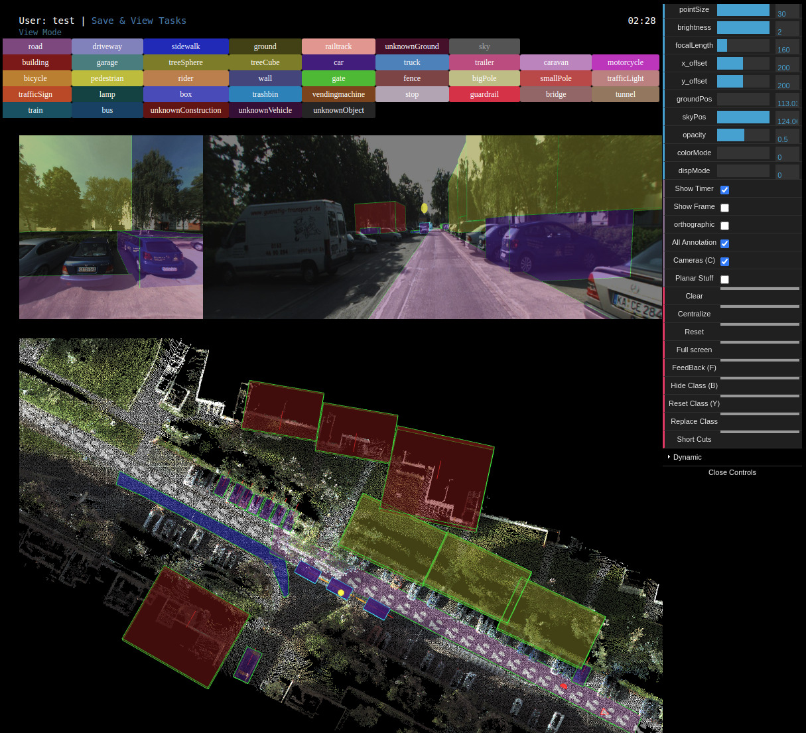

# KITTI-360 Annotation Tool

KITTI-360 Annotation Tool is a framework that developed based on python(cherrypy + jinja2 + sqlite3) as the server end and javascript + WebGL as the front end. It is the annotation tool used to annotate the KITTI-360(TBD: paper link) dataset. 


<p align="center">
   
</p>

## Dependences


  *  __jinja2__ (http://jinja.pocoo.org/)

   ```
   sudo apt install python-pip
   pip install jinja2
   ```


  * __cherrypy__ (http://www.cherrypy.org/)

   ```
   pip install cherrypy
   ```

  * __sqlite__ (https://www.sqlite.org/)

   ```
   sudo apt install sqlite3 libsqlite3-dev
   ```

## Quick Demo

  * Download the data for the demo with the following command:

   ```
   ./download_demo_data.sh
   ```

   * Start the web server with the following command:

   ```
   ./run_demo.sh
   ```

   * Then you can enter the web app at _http://127.0.0.1:8080_ in the browser.


## Demo in Details


### 1. Setup the data

Prepare data and put it in *public/data/*, or you can create a symbolic link from where the data is to *public/data/*

### 2. Configure user-task assignment

The user and task data is kept in db_import/. Example files have been included in `db_import/*.tmp`.

* users.txt

   Each line is one user information in the following order:

   ```
   Email Name UserId Password IsAdmin
   ```

* taskLists.txt

   Each line is one user-task information in the following order:

   ```
   TaskId UserId Editable
   ```
   where `Editable` is a number indicating:

   `Editable = 0`: readonly (User can only view the annotation)

   `Editable = 1`: normal (User can view, annotate, and submit results)

   `Editable = 2`: playground (User can view, annotate, but not submit results)


*Note: space is not allowed in each item. So use '_' or other characters to connect words*


### 3. Setup database

Once the user/task file is setup based on the above rules, to set up database, run

```
python create_db.py
```


### 4. Setup the host and port address

Setup the host and port address in server.conf, here is an example:

```
[global]
server.socket_host = "127.0.0.1" # host to be modified
server.socket_port = 8080        # port to be modified (e.g. 2000)
```


### 5. Start the server

```
python labelApp.py
```


### 6. Load the web page
Type _http://host:port_ in the browser to load the web page. For example in the demo the web app is started locally in _http://127.0.0.1:8080_.

### 7. Play with the labeling interface
Please find details of annotation instruction *[here](https://docs.google.com/document/d/1cXsJF59cwM2f9l6rH1UZSmdlBKWUfbmzTHoI8gyDm2g/edit?usp=sharing)*.


### 8. Get annotation results
Annotation results are saved in xml file under *public/results/*. We provide util functions to parse the xml file in https://github.com/autonomousvision/kitti360Scripts/blob/master/kitti360scripts/helpers/annotation.py#L353.


## Folder Structure


```
.(ROOT)
|
+-- assets
|   |
|   +-- css
|   |
|   +-- javascripts: javascript source code
|
+-- db: generated database (by running create_db.py)
|
+-- db_import
|    |
|    +-- user-task configuration files
|
+-- public
|    |
|    +-- backup: backup XML annotation files, which are automatically saved during annotation
|    |
|    +-- data: annotation data
|    |
|    +-- resource: resource files such as icon
|    |
|    +-- results: resultant XML annotation files
|    |
|    +-- mapping.txt: label mergining file
|    |
|    +-- colorList.txt: label color mapping file
|
+-- views: HTML pages
```

## Common Problems and Solutions


**Q1: "socket.error: (98, 'Address already in use')"**

**A1**: Kill the existing processor and re-restart the server. To kill the existing processor:

1. Run `ps aux | grep python` in command-line.

2. Find the PID with user name = annot, and run `sudo kill -9 PID`.


## Citing KITTI-360 Annotation Tool

If you find this code helpful in your research, please use the following BibTeX entry.


```
@article{Liao2021ARXIV, 
   title   = {{KITTI}-360: A Novel Dataset and Benchmarks for Urban Scene Understanding in 2D and 3D}, 
   author  = {Yiyi Liao and Jun Xie and Andreas Geiger}, 
   journal = {arXiv.org},
   volume  = {2109.13410},
   year    = {2021}, 
}
```


## License
---

MIT License

Copyright (c) 2021 Autonomous Vision Group

Permission is hereby granted, free of charge, to any person obtaining a copy of this software and associated documentation files (the "Software"), to deal in the Software without restriction, including without limitation the rights to use, copy, modify, merge, publish, distribute, sublicense, and/or sell copies of the Software, and to permit persons to whom the Software is furnished to do so, subject to the following conditions:

The above copyright notice and this permission notice shall be included in all copies or substantial portions of the Software.

THE SOFTWARE IS PROVIDED "AS IS", WITHOUT WARRANTY OF ANY KIND, EXPRESS OR IMPLIED, INCLUDING BUT NOT LIMITED TO THE WARRANTIES OF MERCHANTABILITY, FITNESS FOR A PARTICULAR PURPOSE AND NONINFRINGEMENT. IN NO EVENT SHALL THE AUTHORS OR COPYRIGHT HOLDERS BE LIABLE FOR ANY CLAIM, DAMAGES OR OTHER LIABILITY, WHETHER IN AN ACTION OF CONTRACT, TORT OR OTHERWISE, ARISING FROM, OUT OF OR IN CONNECTION WITH THE SOFTWARE OR THE USE OR OTHER DEALINGS IN THE SOFTWARE.

---
